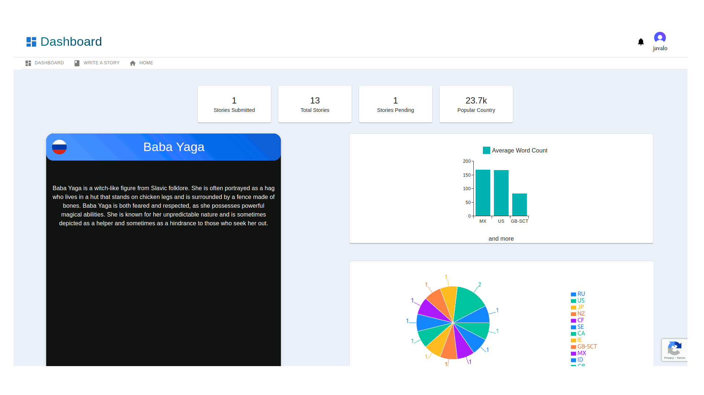
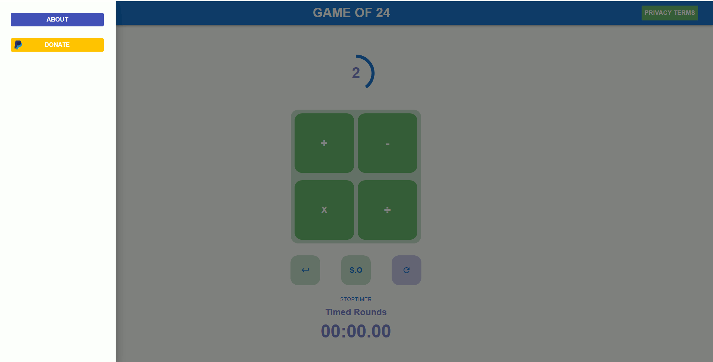

# My Portfolio of Projects

___Hello! This is where I will store all of my Portfolio Projects going forward!___

# Contact Details

* ( https://github.com/joseb2/ )
* ( www.linkedin.com/in/jose-avalos-thompson-6ba002127 )

# Languages and Skills

* 
* 
* 
* 
* 

### Folklore Web Service

* Repository:(https://github.com/joseb2/folklore.io)
* Description: FolkloreAPI is a web service for the everyday writer, inspired artist etc. It stemmed from my desire to start writing where, in doing some research, I found inspiration from various forums and articles on the different categories of folklore and their origins. The hope is for users to submit their own versions of folklore stories to the web service and for it be freely accessible to others looking for the same type of resource.
* Tools: REACT, Express, Axios, JavaScript, HTML, CSS, NodeJS, Leaflet

 

### Game of 24

* Website: www.twentyfourgame.io
* Description: A simple development of the popular math game, 24. The goal of the game is to reach 24 using each number at least once. The implementation was a good test of front-end skills though the implementation is slightly incomplete.
* Tools: REACT, Javascript, HTML, CSS, NextJS
